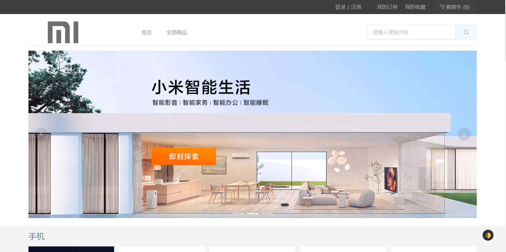
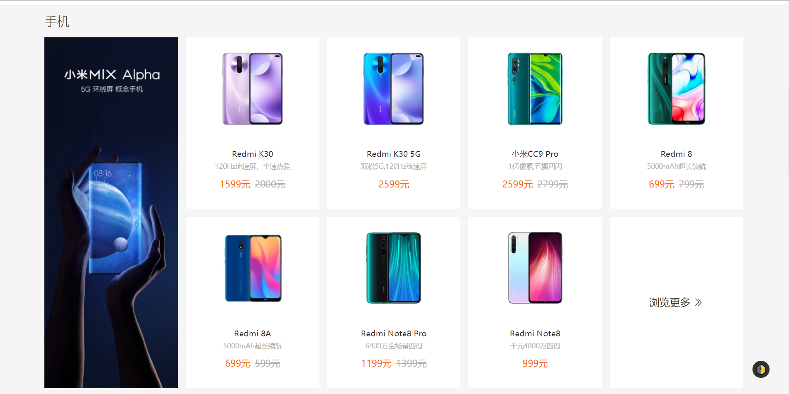
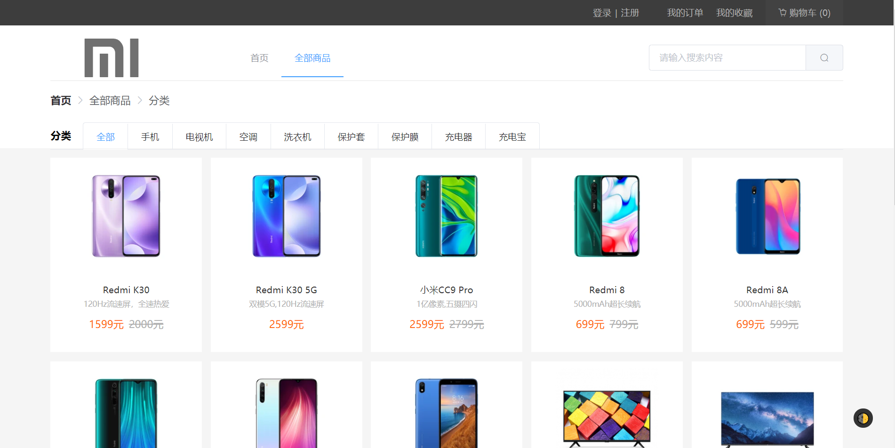
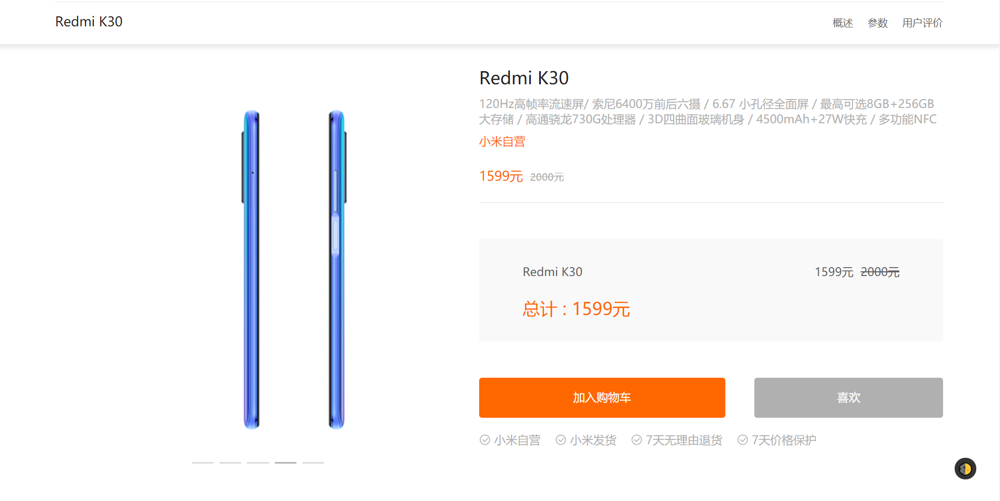
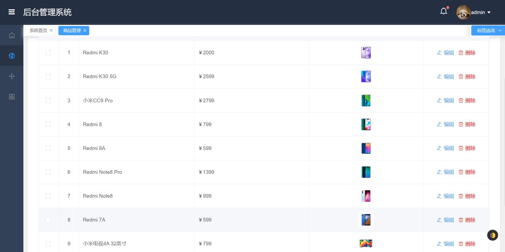
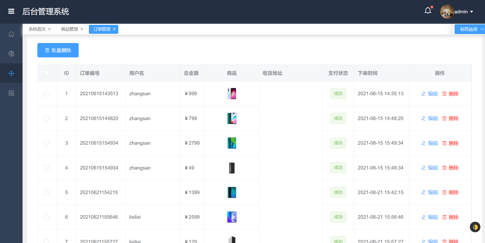
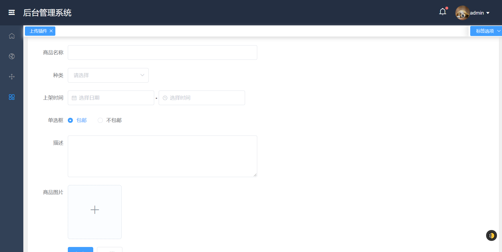

# 小米商城

这是一个练手的项目，模仿小米商城。

本项目是在**小海大佬**的项目上重写的，原项目地址：https://gitee.com/hai-27/vue-store

原来的项目是用`Vue2`的，本人已用`Vue3`全部重写。

后台页面做得比较仓促，有很多功能没有完成，请见谅。参考项目：https://github.com/lin-xin/vue-manage-system

## 项目截图

### 商城前台

### 商城后台

## 一、项目架构

* 前端技术栈：`Vue3`  + `Vuex` + `Element-UI` + `Axios`
* 后端技术栈：`Thinkphp6`
* 数据库：`MySQL`

## 二、实现功能

### 2.1 商品模块

- [x] 商品分页显示
- [x] 商品搜索
- [x] 商品详情
- [x] 商品分类
- [x] 购物车添加、显示、修改、删除
- [x] 收藏添加、显示、修改、删除
- [x] 订单添加、显示、修改、删除
- [x] 评价显示

### 2.2 用户模块

- [x] 注册、登录
- [x] 退出
- [x] 用户名、密码、邮箱非空校验
- [x] 用户名、密码、邮箱格式校验
- [x] 用户是否已被注册
- [x] 收货地址添加、修改、删除、设置默认

### 2.3 后台模块

- [x] 用户登录
- [x] 后台主页
- [x] 订单管理：显示、添加、删除、修改
- [x] 商品管理：显示、添加、删除、修改

 

## 三、部署教程

### 3.1 导入数据库

将数据库代码文件夹下的`Mymi.sql`文件导入到数据库中。

进入`Mysql`后，执行

`source /var/www/mymi/Mymi.sql`

### 3.2 安装后端接口

1、进入后端接口文件夹下的`mymi`文件夹，打开`powershell`或`cmd`窗口

2、在窗口内输入以下命令

> composer install 

3、修改`manage/config/database.php`，修改成你电脑上的数据库和密码。

### 3.3 配置服务器

将网站的根目录设置成`manage`文件夹下的`public`目录。

### 3.4 安装`Node.js`

http://nodejs.cn/download/

### 3.5 商城页面

1、进入商城页面文件夹下的`mymi`文件夹，打开`powershell`或`cmd`窗口

2、在窗口内输入以下命令

> npm install 

3、将`src/Global.js`中的后端地址替换掉

`app.config.globalProperties.$target = "你的后端地址";`

4、在窗口内输入以下命令

> npm run serve

页面默认占用`8080`端口打开。

5、输入上面两条命令，等待命令行窗口加载完，在浏览器输入`http://localhost:8080`即可看到页面。

### 3.6 后台页面

1、进入后台页面文件夹下的`manage`文件夹，打开`powershell`或`cmd`窗口

2、在窗口内输入以下命令

> npm install 

3、将`src/Global.js`中的后端地址替换掉

`app.config.globalProperties.$target = "你的后端地址";`

4、在窗口内输入以下命令

> npm run serve

页面默认占用`8080`端口打开。

5、输入上面两条命令，等待命令行窗口加载完，在浏览器输入`http://localhost:8080`即可看到页面。

